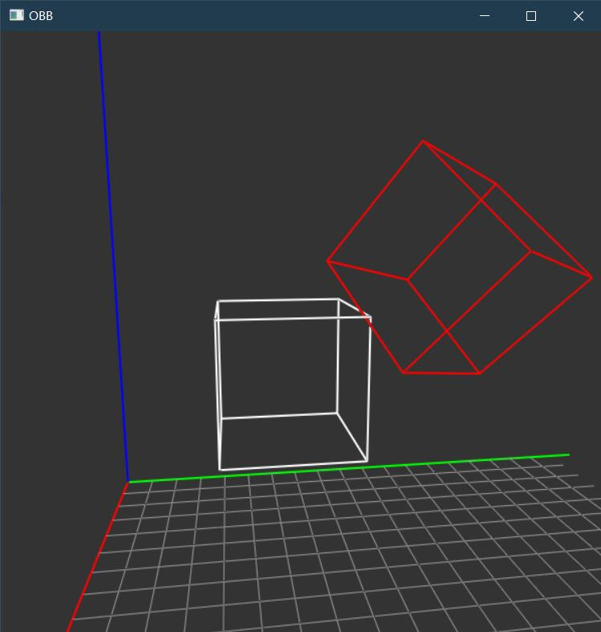

# Graphics-Wheels
Little wheels to help better understand graphics principles.

### Camera
Camera class supports freely roaming.

### Shader
Shader class supports shader loading, compiling, and setting.

### Collision
Implementation of Oriented-Bounding Box.

### Obj Loader
Simple mesh library. Load {.obj} file, analyze it, and generate mesh structures for geometric processing and collision detections.

